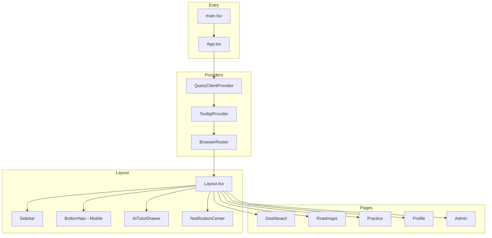
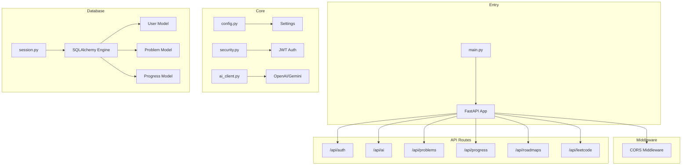

# Full Stack Code Review: Ed-AI

A comprehensive review of both the **Frontend** (React + TypeScript) and **Backend** (FastAPI + Python) for the Ed-AI educational platform.

---

## Table of Contents
- [Technology Overview](#technology-overview)
- [Part 1: Frontend Review](#part-1-frontend-review)
- [Part 2: Backend Review](#part-2-backend-review)
- [Combined Issues Summary](#combined-issues-summary)
- [Priority Action Items](#priority-action-items)

---

## Technology Overview

| Layer | Technology Stack |
|-------|-----------------|
| **Frontend** | React 18, TypeScript, Vite 5, TailwindCSS 3.4, shadcn/ui, React Query, React Router v6 |
| **Backend** | FastAPI, Python, SQLAlchemy ORM, SQLite (dev), Pydantic v2, JWT (python-jose) |
| **AI Integration** | OpenAI GPT-4o, Google Gemini 2.5 Flash (configurable) |
| **External APIs** | LeetCode (scraping-based sync) |

---

# Part 1: Frontend Review

## Architecture Summary



## ✅ Frontend Strengths

### 1. **Well-Structured Design System**
- Full HSL color system with light/dark mode support
- Custom utilities: `glass`, `gradient-primary`, `shadow-glow`, `animate-in`
- Consistent use of Tailwind's design tokens

### 2. **Component Architecture**
- Clean separation between UI components (`/components/ui/`) and feature components
- 49 shadcn/ui components providing accessible, customizable base
- Responsive layout with mobile/desktop switching

### 3. **API Layer Design**
- Centralized API client in [api.ts](file:///d:/Ed-%21/frontend/src/lib/api.ts)
- Proper `fetchWithAuth` wrapper with token handling
- Auto-redirect on 401 responses

### 4. **Feature-Rich Functionality**
- **Practice**: LeetCode integration with auto-sync, pagination, filtering
- **Roadmaps**: AI-powered generation with XP tracking and progress persistence
- **Dashboard**: Gamification (XP, streaks, levels)
- **PWA Support**: Service worker registration

## ⚠️ Frontend Issues

### 1. **Missing Authentication Flow**

> [!CAUTION]
> The app has no login/signup pages but the API expects authentication.

| Problem | Location |
|---------|----------|
| No `/login` route exists | [App.tsx](file:///d:/Ed-%21/frontend/src/App.tsx#L33-L42) |
| Redirects to non-existent `/login` on 401 | [api.ts](file:///d:/Ed-%21/frontend/src/lib/api.ts#L34) |
| User loaded from localStorage without verification | [Sidebar.tsx](file:///d:/Ed-%21/frontend/src/components/Sidebar.tsx#L30-L39) |

---

### 2. **Inconsistent API URL Configuration**

> [!WARNING]
> Three different API URL definitions exist.

| File | Variable | Default Value |
|------|----------|---------------|
| [api.ts](file:///d:/Ed-%21/frontend/src/lib/api.ts#L2) | `VITE_API_URL` | `http://localhost:8000/api` |
| [utils.ts](file:///d:/Ed-%21/frontend/src/lib/utils.ts#L59-L60) | `VITE_API_URL` | `http://127.0.0.1:8000/api` |
| [Admin.tsx](file:///d:/Ed-%21/frontend/src/pages/Admin.tsx#L14) | `VITE_API_BASE_URL` | `http://localhost:8000` (no `/api`) |

---

### 3. **Hardcoded Placeholder Data**

Dashboard and Profile pages use mock data instead of real API calls:
```typescript
// Dashboard.tsx line 17
import { currentUser, activities, roadmaps } from "@/lib/placeholder";
```

---

### 4. **Admin Route Not Protected**

The `/admin` route is accessible to anyone - protection is only cosmetic (hidden nav link):
```typescript
// Sidebar.tsx line 72-81
{user?.role === "admin" && (
  <NavLink to="/admin" ...>
```

---

### 5. **TypeScript `any` Workarounds**

```typescript
// AITutorDrawer.tsx line 109
<ScrollArea className="..." ref={scrollRef as any}>
```

---

### 6. **Console Logs in Production Code**

- [Practice.tsx](file:///d:/Ed-%21/frontend/src/pages/Practice.tsx#L150): `console.log("Loading problems...")`

---

# Part 2: Backend Review

## Architecture Summary



## ✅ Backend Strengths

### 1. **Clean FastAPI Structure**
- Well-organized router modules in `/api/`
- Separated concerns: routes, models, schemas, services
- Pydantic v2 with `pydantic-settings` for configuration

### 2. **Flexible AI Provider System**
- Supports both OpenAI and Google Gemini
- Configurable via `AI_PROVIDER` environment variable
- Async AI calls with proper error handling

### 3. **Authentication Implementation**
- JWT token-based auth with bcrypt password hashing
- `get_current_user` dependency for protected routes
- Proper OAuth2 password flow

### 4. **LeetCode Integration**
- Syncs solved problems from LeetCode profiles
- Maps to internal problem database
- Tracks sync history

### 5. **Comprehensive Roadmap Generation**
- Two-stage AI generation (planner + week-expander)
- Robust JSON extraction with fallback parsing
- XP tracking and progress system

## ⚠️ Backend Issues

### 1. **Hardcoded User ID (Critical)**

> [!CAUTION]
> Multiple routes bypass authentication and use `user_id = 1` hardcoded.

| File | Lines | Issue |
|------|-------|-------|
| [routes_problems.py](file:///d:/Ed-%21/backend/app/api/routes_problems.py#L36) | 36, 135, 201, 252 | `user_id = 1` hardcoded |
| [routes_leetcode.py](file:///d:/Ed-%21/backend/app/api/routes_leetcode.py#L18) | 18 | `user_id = 1` hardcoded |

```python
# routes_problems.py line 36
# TEMPORARY DEV USER
user_id = 1
```

**Impact**: All users share the same progress data.

---

### 2. **CORS Wildcard in Production**

> [!WARNING]
> CORS allows all origins with credentials enabled.

```python
# main.py line 30-36
app.add_middleware(
    CORSMiddleware,
    allow_origins=["*"],  # dev - consider restricting in production
    allow_credentials=True,
    ...
)
```

**Risk**: Security vulnerability when deployed to production.

---

### 3. **Unprotected Admin Endpoint**

The admin stats endpoint requires no authentication:

```python
# routes_progress.py line 17-18
@router.get("/admin-stats")
def get_admin_stats(db: Session = Depends(get_db)):
    # No authentication check!
```

---

### 4. **Missing User Password Field**

The User model doesn't have `password_hash` column defined, but `routes_auth.py` uses it:

```python
# user.py - No password_hash column visible
# routes_auth.py line 31
password_hash=hashed_pw,  # Will fail if column doesn't exist
```

---

### 5. **Default Secret Key in Production**

> [!CAUTION]
> Default secret key is insecure.

```python
# config.py line 17
SECRET_KEY: str = os.getenv("SECRET_KEY", "your-secret-key-change-in-production")
```

---

### 6. **Mixed Session Imports**

Some routes import `get_db` from different locations:

| File | Import |
|------|--------|
| [routes_problems.py](file:///d:/Ed-%21/backend/app/api/routes_problems.py#L8) | `from app.db.session import get_db` |
| [routes_progress.py](file:///d:/Ed-%21/backend/app/api/routes_progress.py#L4) | `from app.db.base import get_db` |

---

### 7. **Chat Endpoint Without Authentication**

```python
# routes_ai.py line 139-140
@router.post("/chat", summary="... - NO AUTH")
async def chat_compat(req: ChatPayload, db: Session = Depends(get_db)):
    # No user authentication!
```

---

### 8. **Deprecated `datetime.utcnow()`**

```python
# security.py line 39
expire = datetime.utcnow() + expires_delta  # Deprecated in Python 3.12
```

Should use: `datetime.now(timezone.utc)`

---

## Combined Issues Summary

### 🔴 Critical (Security)

| # | Issue | Component | Files |
|---|-------|-----------|-------|
| 1 | **Hardcoded user_id = 1** | Backend | routes_problems.py, routes_leetcode.py |
| 2 | **Missing auth pages** | Frontend | App.tsx |
| 3 | **Unprotected admin endpoints** | Both | routes_progress.py, Admin.tsx |
| 4 | **Default SECRET_KEY** | Backend | config.py |
| 5 | **CORS wildcard + credentials** | Backend | main.py |

### 🟡 High Priority (Functionality)

| # | Issue | Component | Files |
|---|-------|-----------|-------|
| 6 | **Inconsistent API URLs** | Frontend | api.ts, utils.ts, Admin.tsx |
| 7 | **Placeholder data in production code** | Frontend | Dashboard.tsx, Profile.tsx |
| 8 | **Chat endpoint without auth** | Backend | routes_ai.py |
| 9 | **Missing password_hash in User model** | Backend | user.py |

### 🟢 Medium/Low Priority (Code Quality)

| # | Issue | Component | Files |
|---|-------|-----------|-------|
| 10 | **TypeScript `any` workarounds** | Frontend | AITutorDrawer.tsx |
| 11 | **Console.log in production** | Frontend | Practice.tsx |
| 12 | **Mixed session imports** | Backend | routes_progress.py |
| 13 | **Deprecated datetime.utcnow()** | Backend | security.py |
| 14 | **Missing error boundaries** | Frontend | - |
| 15 | **Incomplete Profile Stats tab** | Frontend | Profile.tsx |

---

## Priority Action Items

### Immediate (Before First Deploy)

1. **Implement proper authentication**
   - Add `/login` and `/register` pages to frontend
   - Remove all `user_id = 1` hardcoded values in backend
   - Use `get_current_user` dependency on all protected routes

2. **Secure admin access**
   - Add `is_superuser` check to admin endpoints
   - Add frontend route protection for `/admin`

3. **Secure configuration**
   - Generate strong `SECRET_KEY` for production
   - Restrict CORS origins to actual frontend domain

### Before Production

4. **Consolidate API URLs** to single source of truth
5. **Replace placeholder data** with real API calls
6. **Add password_hash column** to User model if missing
7. **Add authentication to `/api/ai/chat`** endpoint

### Code Quality

8. Fix TypeScript `any` casts
9. Remove console.log statements
10. Add error boundaries to frontend
11. Complete Profile Statistics tab
12. Update deprecated `datetime.utcnow()` calls

---

## Files Reviewed

### Frontend
| Category | Files |
|----------|-------|
| Entry | [main.tsx](file:///d:/Ed-%21/frontend/src/main.tsx), [App.tsx](file:///d:/Ed-%21/frontend/src/App.tsx) |
| Layout | [Layout.tsx](file:///d:/Ed-%21/frontend/src/components/Layout.tsx), [Sidebar.tsx](file:///d:/Ed-%21/frontend/src/components/Sidebar.tsx), [BottomNav.tsx](file:///d:/Ed-%21/frontend/src/components/BottomNav.tsx) |
| Pages | [Dashboard.tsx](file:///d:/Ed-%21/frontend/src/pages/Dashboard.tsx), [Practice.tsx](file:///d:/Ed-%21/frontend/src/pages/Practice.tsx), [Roadmaps.tsx](file:///d:/Ed-%21/frontend/src/pages/Roadmaps.tsx), [Profile.tsx](file:///d:/Ed-%21/frontend/src/pages/Profile.tsx), [Admin.tsx](file:///d:/Ed-%21/frontend/src/pages/Admin.tsx) |
| Components | [AITutorDrawer.tsx](file:///d:/Ed-%21/frontend/src/components/AITutorDrawer.tsx) |
| Lib | [api.ts](file:///d:/Ed-%21/frontend/src/lib/api.ts), [utils.ts](file:///d:/Ed-%21/frontend/src/lib/utils.ts) |
| Config | [tailwind.config.ts](file:///d:/Ed-%21/frontend/tailwind.config.ts), [index.css](file:///d:/Ed-%21/frontend/src/index.css), [package.json](file:///d:/Ed-%21/frontend/package.json) |

### Backend
| Category | Files |
|----------|-------|
| Entry | [main.py](file:///d:/Ed-%21/backend/app/main.py) |
| Core | [config.py](file:///d:/Ed-%21/backend/app/core/config.py), [security.py](file:///d:/Ed-%21/backend/app/core/security.py), [ai_client.py](file:///d:/Ed-%21/backend/app/core/ai_client.py) |
| API Routes | [routes_auth.py](file:///d:/Ed-%21/backend/app/api/routes_auth.py), [routes_ai.py](file:///d:/Ed-%21/backend/app/api/routes_ai.py), [routes_problems.py](file:///d:/Ed-%21/backend/app/api/routes_problems.py), [routes_progress.py](file:///d:/Ed-%21/backend/app/api/routes_progress.py), [routes_roadmaps.py](file:///d:/Ed-%21/backend/app/api/routes_roadmaps.py), [routes_leetcode.py](file:///d:/Ed-%21/backend/app/api/routes_leetcode.py) |
| Models | [user.py](file:///d:/Ed-%21/backend/app/models/user.py), [problem.py](file:///d:/Ed-%21/backend/app/models/problem.py), [progress.py](file:///d:/Ed-%21/backend/app/models/progress.py) |
| Database | [session.py](file:///d:/Ed-%21/backend/app/db/session.py), [init_db.py](file:///d:/Ed-%21/backend/app/db/init_db.py) |
| Schemas | [user.py](file:///d:/Ed-%21/backend/app/schemas/user.py), [problem.py](file:///d:/Ed-%21/backend/app/schemas/problem.py) |

---

*Review completed on January 14, 2026*
